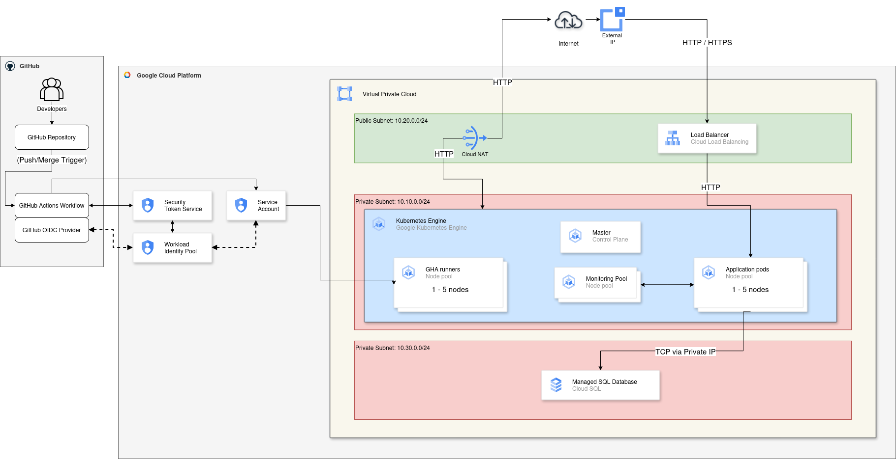

# Infrastructure as Code Architecture



## Overview

The infrastructure deployed on Google Cloud Platform (GCP) includes:

### 🌐 Network

- **VPC Network**: Private virtual network with public and private subnets
- **Cloud NAT**: Allows private resources to access the Internet without a public IP
- **Firewall Rules**: Security rules to control traffic

### ⚙️ Compute

- **GKE Cluster**: Private Kubernetes cluster for container orchestration
  - **App Node Pool**: Nodes dedicated to the application (autoscaling 1-3)
  - **Runners Node Pool**: Nodes for CI/CD workloads (autoscaling 0-2)

### 💾 Database

- **Cloud SQL PostgreSQL**: PostgreSQL instance with private IP only
  - Connected via VPC Peering
  - High availability in production

### 📦 Storage

- **Cloud Storage**: Bucket for artifacts, logs, and backups
- **Container Registry**: Application Docker images

### 🔐 Security

- **Service Accounts**: Identities with minimal permissions (principle of least privilege)
- **Workload Identity**: Secure binding between Kubernetes and GCP
- **Secret Manager**: Centralized secrets management (optional)

## Communication flow

1. **Internet → Load Balancer**: Incoming HTTPS traffic
2. **Load Balancer → GKE**: Distribution to pods
3. **GKE → Cloud SQL**: Connection via private IP (VPC Peering)
4. **GKE → Cloud NAT**: Outbound Internet access
5. **GKE → Cloud Storage**: File storage

## Environments

### Development
- Minimal resources (f1-micro, db-f1-micro)
- Reduced autoscaling
- NodePort for the service

### Production
- Increased resources (e2-medium, db-g1-small)
- Higher autoscaling
- LoadBalancer for the service
- Deletion protection enabled

## Monitoring

- **Cloud Monitoring**: Metrics and alerts
- **Cloud Logging**: Centralized logs
- **Prometheus** (optional): Application metrics

## Network security

```
Internet
    ↓
[Load Balancer]
    ↓
[GKE Cluster - Private]
    ↓
[Cloud SQL - Private IP only]
```

All critical resources (GKE, Cloud SQL) are in private subnets with no direct access from the Internet.
